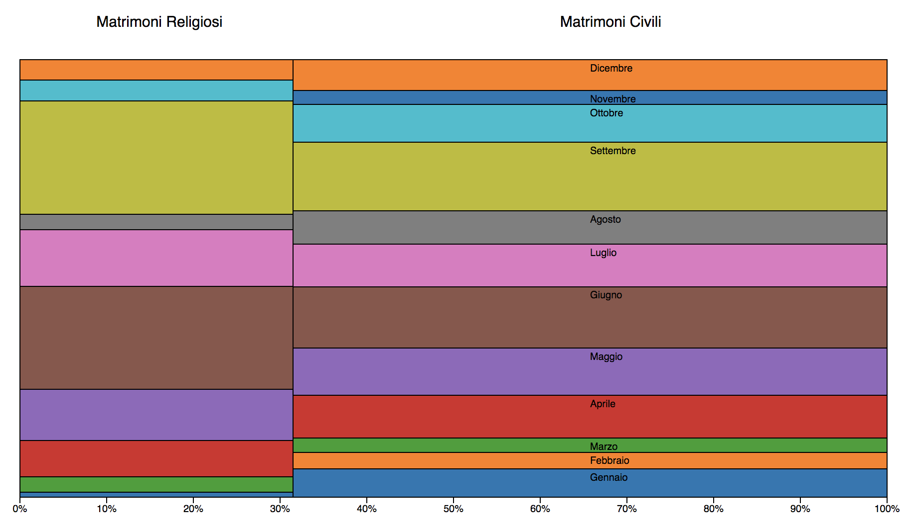

# 2017 Italian Marriages Statistics on Marimekko Chart

Visual representation using the Marimekko Chart to show the distribution of Marriges type in Italy in 2017, split by month

# Data

Data
+ Data is from [dati.veneto.it](http://dati.veneto.it/dataset/matrimoni-per-rito-e-per-mese/resource/3c7811b2-694a-450e-bb24-d11086b8fbe5)

### Prerequisites

You'll need to run some web server software, such as node.js, to access the local resources.

### Built With

* [D3.js](https://d3js.org) - The JavaScript library used

## License

This project is licensed under the MIT License - see the [LICENSE](LICENSE) file for details